# Weekly progress journal
[[_TOC_]]
## Instructions

In this journal you will document your progress of the project, making use of the weekly milestones.

Every week you should 

1. write down **on the day of the lecture** a short plan (bullet list is sufficient) of how you want to 
   reach the weekly milestones. Think about how to distribute work in the group, 
   what pieces of code functionality need to be implemented.
2. write about your progress **until Sunday, 23:59** before the next lecture with respect to the milestones.
   Substantiate your progress with links to code, pictures or test results. Reflect on the
   relation to your original plan.

We will give feedback on your progress on Tuesday before the following lecture. Consult the 
[grading scheme](https://computationalphysics.quantumtinkerer.tudelft.nl/proj1-moldyn-grading/) 
for details how the journal enters your grade.

Note that the file format of the journal is *markdown*. This is a flexible and easy method of 
converting text to HTML. 
Documentation of the syntax of markdown can be found 
[here](https://docs.gitlab.com/ee/user/markdown.html#gfm-extends-standard-markdown). 
You will find how to include [links](https://docs.gitlab.com/ee/user/markdown.html#links) and 
[images](https://docs.gitlab.com/ee/user/markdown.html#images) particularly
useful.

## Week 1
1. General
    - Get used to Gitlab, make first commits and verify that these work.
    - Discuss working method, match schedules to work together.
    - Planned distribution of work:
    
        - Storage of positions/velocities (Abi)
        - Lennard-Jones potential (Abi)
        - Euler method (Jim)
        - Periodic boundary condition (Abi)
        - Total energy (Abi)
        - Journal-keeping (Jim)
        - Initialize positions/velocities (Jim)
        - Define necessary constants (Jim)
    
2. Objectives
    - [x] Calculate the force on each particle using the Lennard-Jones potential
    - [x] Implement the Euler method for time evolution
    - [x] Implement the periodic boundary condition
    - [x] Define a function that calculates the total energy of the system
    - [x] Make sure that you commit your code regularly to Gitlab.
    
3. Things that need improvement
    - Velocity initial vector needs some improvements, this looks not right.  Also, it is based on a 3D function.
    - Simulation is still not finished totally
    - Overall code "running". Currently, it is function after function to tackle the problems, not yet a working running program. Still a lot of work in progress thus. 

4. Things that went right
    - We implemented the code for many particles, not just 2. debugging will be harder in future. Also, we have accounted for that the dimensions might be 2 or 3.

5. Things that went wrong
    - Underestimated the time requirement for programming. There is so much more to do and improve, although our code has decent functionality, it needs a whole lot more attention to details.

6. Review (w.r.t) original plan
    - The original plan was followed more or less as intended as can be seen in the GitLab commits history. The only differences are that Abi started the Lennard-Jones potential code, which Jim improved later on. And Abi started on the necessary constants, which Jim improved later on as well.
    - Final distribution of work:
    
        - Storage of positions/velocities (Abi)
        - Lennard-Jones potential (Abi/Jim)
        - Euler method (Jim)
        - Periodic boundary condition (Abi)
        - Total energy (Abi)
        - Journal-keeping (Jim)
        - Initialize positions/velocities (Jim)
        - Define necessary constants (Abi/Jim)
        
## Week 2

1. General
    - No planned distribution of work this week, beforehand knowing how time consuming each objective is going to be is hard. We decided to update eachother personally on Whatsapp when:
        - Problems were solved
        - Remarks on code
        - Bugfixes of the code of parter
    - Periodic boundary conditions were implemented of last week.
    
    
2. Milestones
    - [x] Derive the expression of the kinetic energy in dimensionless units
    - [x] Change your existing molecular dynamics simulation to now use dimensionless units
    - [x] Implement the minimal image convention
    - [x] Simulate 2 atoms in 3D space. Choose their initial positions close to the boundary. This way, you can clearly see if the periodic boundary conditions work. Plot their inter-atom distance over time. Furthermore, also plot the kinetic and potential energy, as well as their sum, over time.

3. Things that need improvement
    - Overall readability of code
    - Axis scaling when switching from dimensional to non-dimensionality.
    - A time dependent 2D plot, like in the lecture notes of week 1,2 would be a nice functionality.
    
4. Things that went right
    - Work ethic.

5. Things that went wrong
    - Code could use more comments, especially when complexity/length increases during next weeks.
    
6. Review (w.r.t) original plan
    - No original plan was created, except meeting milestones.
    
7. Figures and plots

    
    
    - In the figures above a plot is shown of 2 particles in 3 dimensions, with initial vecotrs
             init_pos = [[9.9, 9.8, 8.7], [0.3, 0.6, 0.3]]
             init_vel = [[1.0, 1.0, 1.2], [-1.0, -1.2, -0.9]]
             Box size = 10 (dimless)
    - Here we can clearly see that periodic boundary conditions work in the first figure.
    - In the second figure, we see the kinetic energy of the particles in blue, which clearly increases when  they get closer. Also, the energy first "dips", this is probably due to the nature of the potential energy having a dependance on r^6 and r^12.
    - However, total energy is not fully conserved, but "quite" close (delta total energy:   -0.35808706086647657)
             
              

8. Notes
    - to run the code, please fully run skeleton.py file. Parameters can be set in the top section. main() function is the function to combine functions to produce plots.
    
## Week 3

1. General
    - No planned distribution of work this week, beforehand knowing that we already met some milestones of this week already. We decided to update eachother personally on Whatsapp when:
        - Problems were solved
        - Remarks on code
        - Bugfixes of the code of parter
    - In case of help or not understanding each other's code, Discord calls were made to discuss.
    
2. Milestones
    - [x] Extend your code to more than 2 particles.
    - [x] Implement the velocity-Verlet algorithm.
    - [x] Investigate the conservation of energy in the system. Plot the evolution of the kinetic and potential energy, as well as their sum.
    - [x] Compare the results of energy conservation using the Euler and Verlet algorithms.
    - [x] Make an initial attempt to structure your code properly.

3. Things that need improvement
    - simulate_old function should be removed when we feel confident that the new function is a proper replacement
    - Axis scaling when switching from dimensional to non-dimensionality.
    - A time dependent 2D plot, like in the lecture notes of week 1,2 would be a nice functionality. (optional)
    
4. Things that went right
    - Work ethic.
    - Reduced amount of steps as was advised in previous feedback (from Week 2)
    - Split plotting code in a different function outside the main() function to allow re-runs/re-simulations.
    - Updated readme file

5. Things that went wrong
    - No mentionable things

6. Review (w.r.t) original plan
    - No original plan was created, except meeting milestones.
    
7. Figures and plots

    
    
    - In the figures above a plot is shown of 9 particles in 3 dimensions, with initial vectors
    
        init_pos = [[9.9, 9.6, 8.7], [0.3, 0.6, 0.3], [3.5, 4.6, 5.7], [9.9, 3.3, 6.6], [6.0, 7.5, 9.0],
                [0.6, 0.6, 9.0], [3.3, 3.3, 3.3], [8.8, 2.7, 6.3], [6.3, 8.7, 1.5]]
                
        init_vel = [[1.2, 0.9, 1.2], [-0.9, -0.9, -0.6], [-0.9, 0.9, 1.5], [1.5, -0.3, 0.9], [0.0, -1.5, 0.3]
        , [-0.2, 1.5, -0.3], [1.2, 0.6, -0.9], [-0.3, -1.2, 0.0], [1.2, 0.0, -0.6]]
        
        box size = 10 (dimless)
    - The plots show the energies: blue as kinetic energy, green as total energy and orange as potential energy.
    - The first plot is created by a simulation using Verlet's algorithm, the second plot is created by a simulation using Euler's algorithm.
    - It can be seen that the difference between these plots cannot be seen; this is to be expected as the difference between both algorithms is negligible.
    - The numerical (non-dimensional) values are 9.547073186545731, 11.378621347254516 and 1.8315481607087847 for the initial total energy, final total energy and delta total energy respectively. (Both Verlet's and Euler's algorithms have these values identically)
    - The maximum (non-dimensional) error in the position-data is 0.0. The maximum error in the velocity data is 2.6716075737639904e-83.
    - For random initial positions and velocities, the simulations show better that the energy is conserved than in this example.

8. Notes
    - to run the code, please fully run skeleton.py file. Parameters can be set in the top section. main() function is the function to combine functions to produce plots.

## Week 4
1. General
    - No planned distribution of work this week, beforehand knowing that we already met some milestones of this week already. We decided to update eachother personally on Whatsapp when:
        - Problems were solved
        - Remarks on code
        - Bugfixes of the code of partner
    - In case of help or not understanding each other's code, Discord calls were made to discuss.
    
2. Milestones
    - [x] Implement the initialization of positions onto an FCC lattice.
    - [x] Show that the initial velocities obey a Maxwell-Boltzmann distribution.
    - [x] Perform the rescaling of temperature and show how the desired temperature is attained after a certain amount of rescaling and equilibrating.
    - [ ] Study at least one observable, and compare its behaviour to literature.

3. Things that need improvement
    - simulate_old function should be removed when we feel confident that the new function is a proper replacement
    - init_velocityold function should be removed when we feel confident that the new function is a proper replacement
    - Axis scaling when switching from dimensional to non-dimensionality.
    - A time dependent 2D plot, like in the lecture notes of week 1,2 would be a nice functionality. (optional)
    - Cleaning up old/unused code
    - Use a fixed seed to reproduce 'pseudo-random' simulations
    
4. Things that went right
    - Fixed kinetic energy as was advised in the feedback from Week 3.
        - Bug was not present in kinetic energy
    - Fixed velocity initialization so negative values are also used
    - Fixed initialization so now it is temperature dependant
    - Fixed velocity initialization so the expected mean (from MB-distibution) also works in higher dimensions
    - Improved velocity initialization so the final mean over all particles is 0 to avoid 'drift velocity'.

5. Things that went wrong
    - We did not understand the rescaling of temperature (yet!) to implement this properly...
        - Lack of understanding is most probable due to time constraints.
        - Due to multiple deadlines, and an exam coming up for both of us next Tuesday we could not put enough time in the project as we wanted to.
        - However, due to a course ending next Tuesday we have the ability to make this project our full priority for next week. 

6. Review (w.r.t) original plan
    - No original plan was created, except meeting milestones.
    - For next week, due to increased load of missed milestones for this week we do need to set internal deadlines and make plans.
    
7. Figures and plots

    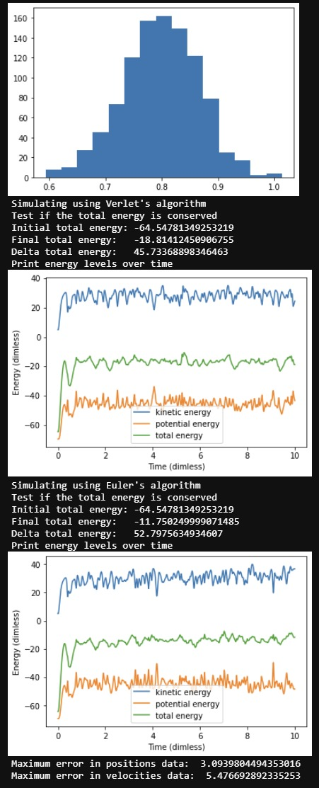
    - In the figures above a plot is shown of 16 particles in 3 dimensions, with initial vectors
    
        init_pos = using fcc lattice function
                
        init_vel = using init velocities function
        
        box size = 2 * 1.547
    - The top plot shows the distribution of 1000 initial velocities to show it holds to a Gaussian/MB distribution.
    - We can see the top plot somewhat matches a Maxwell-Boltzmann distribution.
    - The middle and bottom plot show the energies: blue as kinetic energy, green as total energy and orange as potential energy.
    - The middle plot is created by a simulation using Verlet's algorithm
    - The bottom plot is created by a simulation using Euler's algorithm
    - We can see the errors are bigger in Euler's algorithm as expected
    - Errors are now present in both position and velocity when comparing Verlet's and Euler's algorithms.
    
    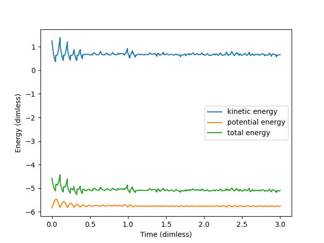
    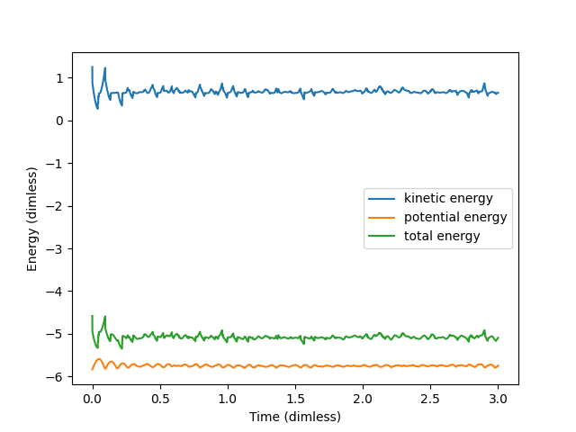
    - Attempt to apply temperature rescaling to velocity.
    - Uses time-averages for kinetic energy to see whether the later time-average has stabillized more than the previous time-average.
    - The threshold value was chosen to be 0.0003 for better convergence.
    - In the top plot Verlet's algorithm is used, in the bottom plot Euler's algorithm is used.
    - Data values Verlet's algorithm:
        - Rescaled 17719 times [ 0.8568022650005982 ~ 1.1492767191445308 ]
        - Test if the total energy is conserved
        - Initial total energy: -4.580495360788052
        - Final total energy:   -5.097683492887791
        - Delta total energy:   -0.5171881320997391
    - Data values Euler's algorithm:
        - Rescaled 16979 times [ 0.8446877607516494 ~ 1.245855408163942 ]
        - Test if the total energy is conserved
        - Initial total energy: -4.580495360788052
        - Final total energy:   -5.091795563867885
        - Delta total energy:   -0.5113002030798333
    - Verlet's algorithm versus Euler's algorithm:
        - Maximum error in positions data:  1.5387716436236905
        - Maximum error in velocities data:  0.7546526287085809
    - Minimum and maximum rescale values (lambda) are given in the data values between the square brackets.
    
8. Notes
    - to run the code, please fully run skeleton.py file. Parameters can be set in the top section. main() function is the function to combine functions to produce plots.
    

## Week 5
1. General
    - A small plan of work this week:
        - Fix the kinetic energy first using a 2 particle simulation to find the culprit.
        - Fix the temperature rescaling using the improved kinetic energy
        - Add observable(s) after stable temperature rescaling
        - Meet milestones of this week
    - We decided to update eachother personally on Whatsapp when:
        - Problems were solved
        - Remarks on code
        - Bugfixes of the code of partner
    - In case of help or not understanding each other's code, Discord calls were made to discuss.
    
2. Milestones
    - [x] Implement calculation of errors and test your implementation on data with a known correlation time. You can get the code to generate random data with a specified autocorrelation time here.
    - [x] Compute observables including errors.
    - [x] Make sure your code is structured logically.
    - [ ] Make a plan for simulations to go into the report: How do you want to validate your simulation, and which observables/simulations do you want to run?
    - [ ] Make a brief statement about the efficiency of your code: can you run the simulations you would like to do? Would it make sense to improve performance?

3. Things that need improvement
    - For loops need to be replaced with (element-wise) matrix/vector/array multiplications to improve performance
    - Axis scaling when switching from dimensional to non-dimensionality.
    - A time dependent 2D plot, like in the lecture notes of week 1,2 would be a nice functionality. (optional)
    
4. Things that went right
    - Fixed kinetic energy as was advised in the feedback from Week 3 and 4.
        - Bug was not present in kinetic energy but in LJ-force
        - Power ^7 was missing in LJ-force
        - Factor *2 was removed in LJ-force
    - Cleaned up old (unused) code
    - Added FCC lattice plot
    - Improved temperature rescaling (with maximum rescaling amount, maximum rescaling time-window, delta parameter, etc.)
    - Converted 'discontinuous' position data to 'continuous' position data (discontinuity due to periodicity)
    - Fixed velocity initialization so negative values are also used
    - Fixed initialization so now it is temperature dependant
    - Fixed velocity initialization so the expected mean (from MB-distibution) also works in higher dimensions
    - Improved velocity initialization so the final mean over all particles is 0 to avoid 'drift velocity'.

5. Things that went wrong
    - Time management

6. Review (w.r.t) original plan
    - First points of our plan were met. 
    - The milestones were met more or less, there is room for improvement still.
    - Further discussion can be found in point 8 below (as part of the milestones).
    
7. Figures and plots

    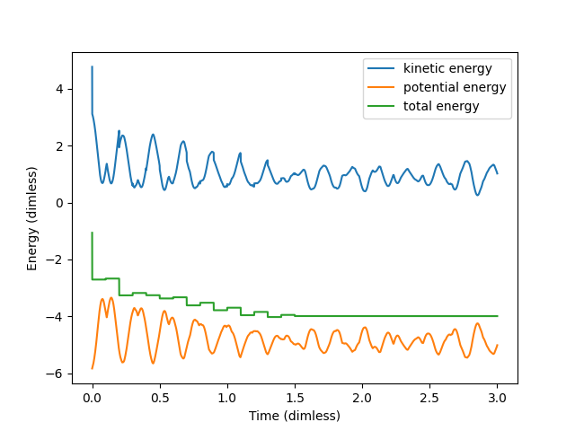
    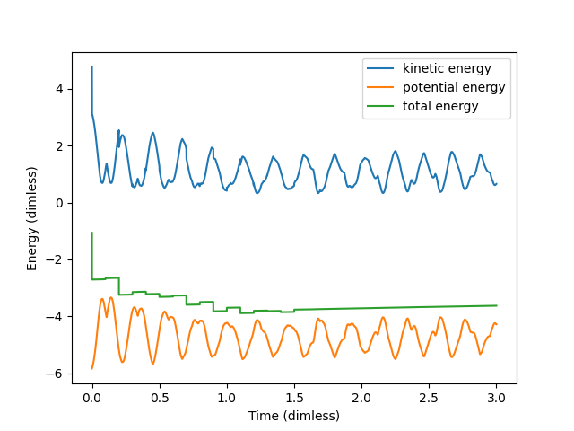
    - Attempt to apply temperature rescaling to velocity.
    - Uses time-averages for kinetic energy to see whether it converges to the target kinetic energy
    - In the top plot Verlet's algorithm is used, in the bottom plot Euler's algorithm is used.
    - The simulation is done with 4 particles (in FCC lattice) with random velocities.
    - Data values Verlet's algorithm:
        - Rescaled 16 times with λ: [ 0.8093224429233407 ~ 1.09761289352804 ]
        - Test if the total energy is conserved
        - Initial total energy: -1.0618281341493052
        - Final total energy:   -3.991753768577154
        - Delta total energy:   -2.929925634427849
    - Data values Euler's algorithm:
        - Rescaled 16 times with λ: [ 0.8093040879418126 ~ 1.1324341678961662 ]
        - Test if the total energy is conserved
        - Initial total energy: -1.0618281341493052
        - Final total energy:   -3.6255841659786023
        - Delta total energy:   -2.563756031829297
    - Verlet's algorithm versus Euler's algorithm:
        - Maximum error in positions data:  1.5468906302324594
        - Maximum error in velocities data:  1.4041475121109088
    - Minimum and maximum rescale values (lambda) are given in the data values between the square brackets.
    
    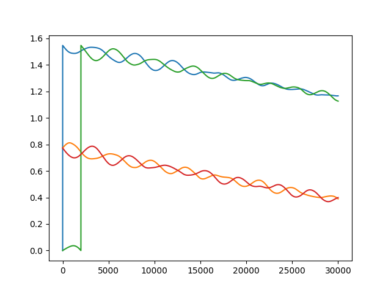
    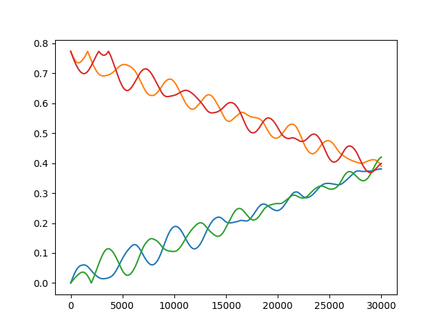
    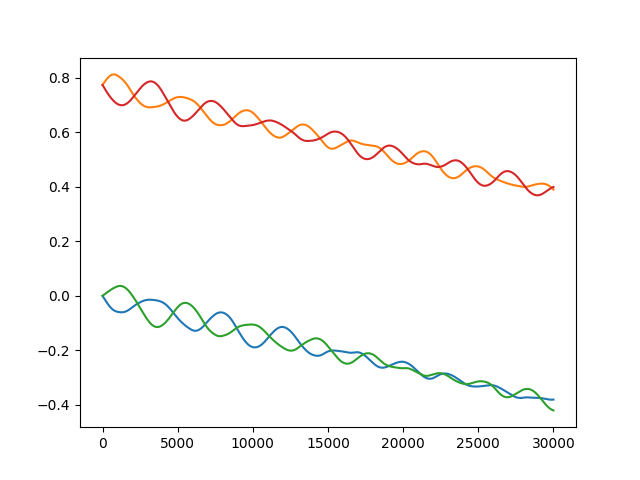
    - In the figures above a plot is shown of the x-component of the positions.
        - The top plot shows the position data coming from our simulation data
        - The middle plot is a fast approximation for continuous position data (less accurate)
        - The bottom plot is a slower approach for continuous position data (more accurate)
    - The slower but more accurate approach will be used to determine the diffusion constant

    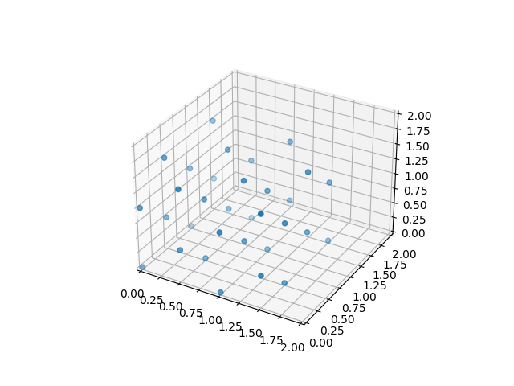
    - In this plot a FCC lattice with 32 particles is made. It would be possible to create a full simulation, this would take an entire night to run approximately.
    - This plot is merely to showcase that it is possible to have a FCC lattice simulation of 4N particles with N>0.

    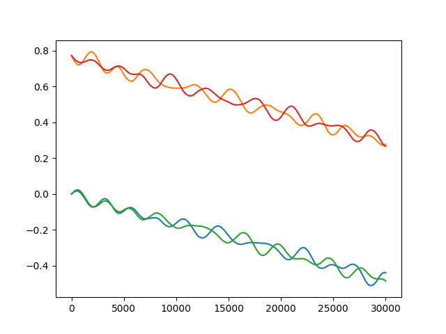
    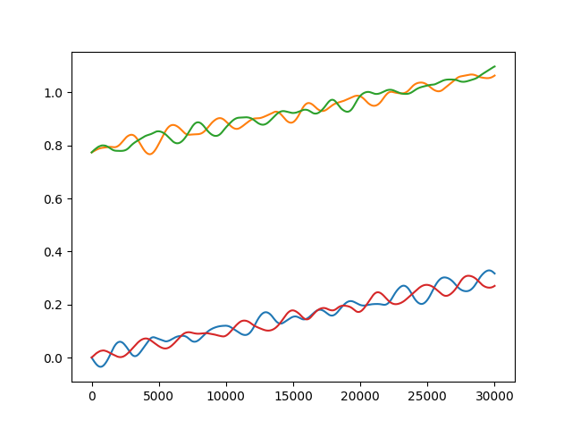
    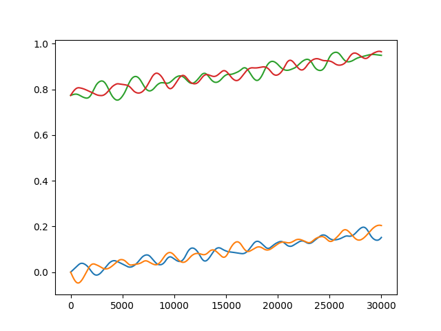
    - The above plots are made using a random simulation (target temperature: 70K, particles: 4)
    - The top plot shows x-components, the middle plot shows y-components and the bottom plot shows z-componenets.
    - We are able to see that the particles seem to circle around each other in pairs (it seems that way).
    - We are also able to see that all particles drift off (a little bit) in pairs in a negative x, positive y and positive z direction.
    
    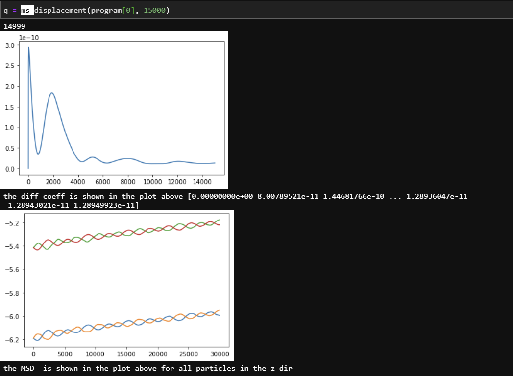
    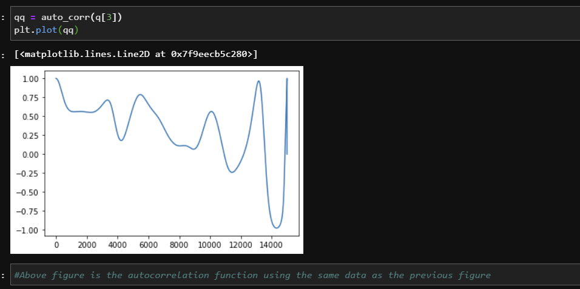
    - The top plot shows how the diffusion coefficient is derived.
        - We expect the diffusion plot to go to 0 with an exponential decay.
        - Although the plot does not match our expectation, it is still close.
    - The bottom plot shows the autocorrelation function.
        - ...
8. Future plan
    - Report:
        - To validate our simulations we will go back to 2 particles with simple box dimensions. Here we can compare a few handpicked and handwritten solutions to handpicked and computed solutions.
        - To validate our simulations we will compare Verlet's and Euler's algorithms to show the difference in errors matches our expectations (Our expectation: the error is higher with Euler)
        - Our observables are: diffusion, center of mass, drift velocity and energy
    - Code:
        - Our simulations run efficiently, however, there is room for improvement.
        - Our code could be improved by the points mentioned in point 3 above.
        - It would make sense to optimize our code to increase the amount of testing/improving/bugfixing possible within a limited timeframe.
        - It would also make sense to optimize our code to allow more complex simulations
9. Notes
    - To run the code, please fully run skeleton.py file. Parameters can be set in the top section. main() function is the function to combine functions to produce plots.
