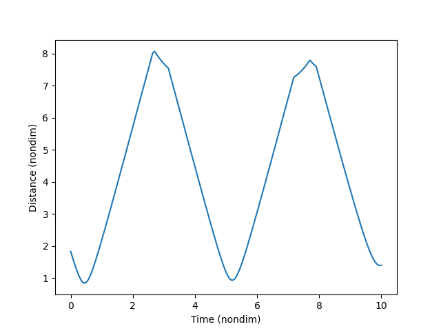
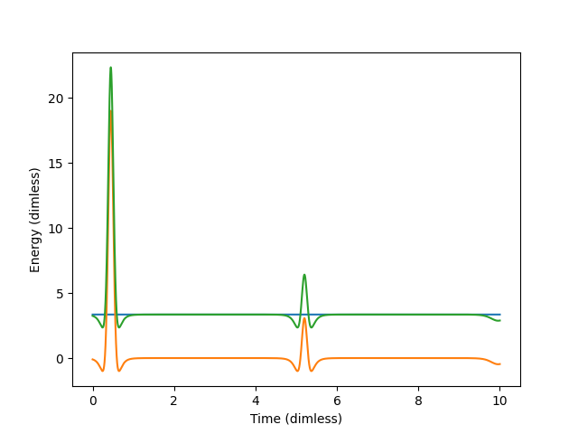
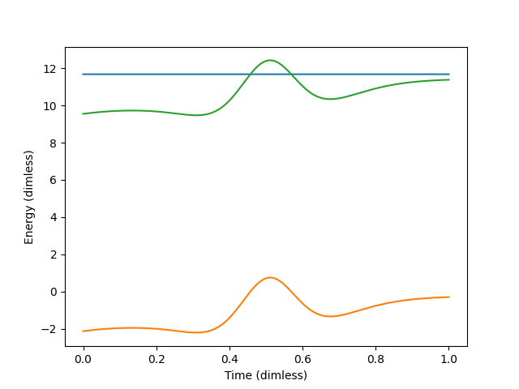

# Weekly progress journal
[[_TOC_]]
## Instructions

In this journal you will document your progress of the project, making use of the weekly milestones.

Every week you should 

1. write down **on the day of the lecture** a short plan (bullet list is sufficient) of how you want to 
   reach the weekly milestones. Think about how to distribute work in the group, 
   what pieces of code functionality need to be implemented.
2. write about your progress **until Sunday, 23:59** before the next lecture with respect to the milestones.
   Substantiate your progress with links to code, pictures or test results. Reflect on the
   relation to your original plan.

We will give feedback on your progress on Tuesday before the following lecture. Consult the 
[grading scheme](https://computationalphysics.quantumtinkerer.tudelft.nl/proj1-moldyn-grading/) 
for details how the journal enters your grade.

Note that the file format of the journal is *markdown*. This is a flexible and easy method of 
converting text to HTML. 
Documentation of the syntax of markdown can be found 
[here](https://docs.gitlab.com/ee/user/markdown.html#gfm-extends-standard-markdown). 
You will find how to include [links](https://docs.gitlab.com/ee/user/markdown.html#links) and 
[images](https://docs.gitlab.com/ee/user/markdown.html#images) particularly
useful.

## Week 1
1. General
    - Get used to Gitlab, make first commits and verify that these work.
    - Discuss working method, match schedules to work together.
    - Planned distribution of work:
    
        - Storage of positions/velocities (Abi)
        - Lennard-Jones potential (Abi)
        - Euler method (Jim)
        - Periodic boundary condition (Abi)
        - Total energy (Abi)
        - Journal-keeping (Jim)
        - Initialize positions/velocities (Jim)
        - Define necessary constants (Jim)
    
2. Objectives
    - [x] Calculate the force on each particle using the Lennard-Jones potential
    - [x] Implement the Euler method for time evolution
    - [x] Implement the periodic boundary condition
    - [x] Define a function that calculates the total energy of the system
    - [x] Make sure that you commit your code regularly to Gitlab.
    
3. Things that need improvement
    - Velocity initial vector needs some improvements, this looks not right.  Also, it is based on a 3D function.
    - Simulation is still not finished totally
    - Overall code "running". Currently, it is function after function to tackle the problems, not yet a working running program. Still a lot of work in progress thus. 

4. Things that went right
    - We implemented the code for many particles, not just 2. debugging will be harder in future. Also, we have accounted for that the dimensions might be 2 or 3.

5. Things that went wrong
    - Underestimated the time requirement for programming. There is so much more to do and improve, although our code has decent functionality, it needs a whole lot more attention to details.

6. Review (w.r.t) original plan
    - The original plan was followed more or less as intended as can be seen in the GitLab commits history. The only differences are that Abi started the Lennard-Jones potential code, which Jim improved later on. And Abi started on the necessary constants, which Jim improved later on as well.
    - Final distribution of work:
    
        - Storage of positions/velocities (Abi)
        - Lennard-Jones potential (Abi/Jim)
        - Euler method (Jim)
        - Periodic boundary condition (Abi)
        - Total energy (Abi)
        - Journal-keeping (Jim)
        - Initialize positions/velocities (Jim)
        - Define necessary constants (Abi/Jim)
        
## Week 2

1. General
    - No planned distribution of work this week, beforehand knowing how time consuming each objective is going to be is hard. We decided to update eachother personally on Whatsapp when:
        - Problems were solved
        - Remarks on code
        - Bugfixes of the code of parter
    - Periodic boundary conditions were implemented of last week.
    
    
2. Milestones
    - [x] Derive the expression of the kinetic energy in dimensionless units
    - [x] Change your existing molecular dynamics simulation to now use dimensionless units
    - [x] Implement the minimal image convention
    - [x] Simulate 2 atoms in 3D space. Choose their initial positions close to the boundary. This way, you can clearly see if the periodic boundary conditions work. Plot their inter-atom distance over time. Furthermore, also plot the kinetic and potential energy, as well as their sum, over time.

3. Things that need improvement
    - Overall readability of code
    - Axis scaling when switching from dimensional to non-dimensionality.
    - A time dependent 2D plot, like in the lecture notes of week 1,2 would be a nice functionality.
    
4. Things that went right
    - Work ethic.

5. Things that went wrong
    - Code could use more comments, especially when complexity/length increases during next weeks.
    
6. Review (w.r.t) original plan
    - No original plan was created, except meeting milestones.
    
7. Figures and plots

    
    
    - In the figures above a plot is shown of 2 particles in 3 dimensions, with initial vecotrs
             init_pos = [[9.9, 9.8, 8.7], [0.3, 0.6, 0.3]]
             init_vel = [[1.0, 1.0, 1.2], [-1.0, -1.2, -0.9]]
             Box size = 10 (dimless)
    - Here we can clearly see that periodic boundary conditions work in the first figure.
    - In the second figure, we see the kinetic energy of the particles in blue, which clearly increases when  they get closer. Also, the energy first "dips", this is probably due to the nature of the potential energy having a dependance on r^6 and r^12.
    - However, total energy is not fully conserved, but "quite" close (delta total energy:   -0.35808706086647657)
             
              

8. Notes
    - to run the code, please fully run skeleton.py file. Parameters can be set in the top section. main() function is the function to combine functions to produce plots.
    
## Week 3

1. General
    - No planned distribution of work this week, beforehand knowing that we already met some milestones of this week already. We decided to update eachother personally on Whatsapp when:
        - Problems were solved
        - Remarks on code
        - Bugfixes of the code of parter
    - In case of help or not understanding each other's code, Discord calls were made to discuss.
    
2. Milestones
    - [x] Extend your code to more than 2 particles.
    - [x] Implement the velocity-Verlet algorithm.
    - [x] Investigate the conservation of energy in the system. Plot the evolution of the kinetic and potential energy, as well as their sum.
    - [x] Compare the results of energy conservation using the Euler and Verlet algorithms.
    - [x] Make an initial attempt to structure your code properly.

3. Things that need improvement
    - simulate_old function should be removed when we feel confident that the new function is a proper replacement
    - Axis scaling when switching from dimensional to non-dimensionality.
    - A time dependent 2D plot, like in the lecture notes of week 1,2 would be a nice functionality. (optional)
    
4. Things that went right
    - Work ethic.
    - Reduced amount of steps as was advised in previous feedback (from Week 2)
    - Split plotting code in a different function outside the main() function to allow re-runs/re-simulations.
    - Updated readme file

5. Things that went wrong
    - No mentionable things

6. Review (w.r.t) original plan
    - No original plan was created, except meeting milestones.
    
7. Figures and plots

    
    
    - In the figures above a plot is shown of 9 particles in 3 dimensions, with initial vectors
    
        init_pos = [[9.9, 9.6, 8.7], [0.3, 0.6, 0.3], [3.5, 4.6, 5.7], [9.9, 3.3, 6.6], [6.0, 7.5, 9.0],
                [0.6, 0.6, 9.0], [3.3, 3.3, 3.3], [8.8, 2.7, 6.3], [6.3, 8.7, 1.5]]
                
        init_vel = [[1.2, 0.9, 1.2], [-0.9, -0.9, -0.6], [-0.9, 0.9, 1.5], [1.5, -0.3, 0.9], [0.0, -1.5, 0.3]
        , [-0.2, 1.5, -0.3], [1.2, 0.6, -0.9], [-0.3, -1.2, 0.0], [1.2, 0.0, -0.6]]
        
        box size = 10 (dimless)
    - The plots show the energies: blue as kinetic energy, green as total energy and orange as potential energy.
    - The first plot is created by a simulation using Verlet's algorithm, the second plot is created by a simulation using Euler's algorithm.
    - It can be seen that the difference between these plots cannot be seen; this is to be expected as the difference between both algorithms is negligible.
    - The numerical (non-dimensional) values are 9.547073186545731, 11.378621347254516 and 1.8315481607087847 for the initial total energy, final total energy and delta total energy respectively. (Both Verlet's and Euler's algorithms have these values identically)
    - The maximum (non-dimensional) error in the position-data is 0.0. The maximum error in the velocity data is 2.6716075737639904e-83.
    - For random initial positions and velocities, the simulations show better that the energy is conserved than in this example.

8. Notes
    - to run the code, please fully run skeleton.py file. Parameters can be set in the top section. main() function is the function to combine functions to produce plots.

## Week 4
(due 7 March 2021, 23:59)

## Week 5
(due 14 March 2021, 23:59)
